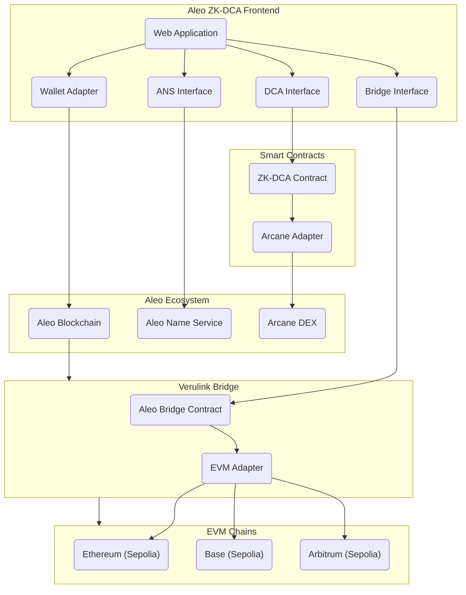

# ZK-DCA: The Firs Privacy-Preserving Dollar-Cost Averaging on Aleo

## Project Overview

ZK-DCA is a privacy-preserving Automated Dollar-Cost Averaging protocol built on Arcane Finance's DEX platform. It allows users to set up recurring, private investments into crypto assets while leveraging Arcane's liquidity pools, all with the privacy guarantees of Aleo's zero-knowledge technology.

## Key Features

- **Private Recurring Investments**: Schedule regular investments without revealing your strategy or amounts
- **Integrated with Arcane DEX**: Utilize Arcane's arcn_pool_v2_2_4.aleo program for liquidity and swaps
- **Flexible Parameters**: Configure investment frequency, amounts, and target assets privately
- **Withdrawal Privacy**: Extract funds without leaking your investment history
- **Cross-Chain Compatibility**: Bridge assets from Ethereum, Base, and Arbitrum via Verulink
- **Human-Readable Addresses**: ANS integration for improved user experience
- **Privacy-Preserving**: All operations maintain zero-knowledge properties

## Demo Video 

https://github.com/user-attachments/assets/aa80f30e-3d24-4d43-8f3b-e6df84e1b882

## Architecture Overview

## Ecosystem Integration

### Aleo Name Service (ANS)

The Aleo Name Service integration provides:
- **Human-Readable Addresses**: Map complex Aleo addresses to simple names (e.g., alice.aleo)
- **Public DCA Discovery**: Browse public DCA positions by ANS name instead of addresses
- **Profile Management**: Link additional metadata to your Aleo identity
- **Improved UX**: Simplify address entry when creating DCA positions or transferring assets

### Verulink Bridge

The Verulink Bridge enables cross-chain functionality:
- **Multi-Chain Support**: Connect Aleo with Ethereum, Base, and Arbitrum Sepolia networks
- **Cross-Chain DCA**: Create DCA positions using assets from EVM chains
- **Seamless Asset Transfer**: Bridge tokens between chains with a simple interface
- **Transaction History**: Track all cross-chain transfers with detailed status updates
- **Unified Experience**: Manage assets across multiple blockchains in one interface

### Arcane Finance for Privacy Swaps

Arcane Finance integration provides:
- **Private DEX**: Execute swaps without revealing trade details
- **Deep Liquidity**: Access to Arcane's liquidity pools via arcn_pool_v2_2_4.aleo
- **Minimal Slippage**: Optimized routing for best execution prices
- **Combined Privacy**: DCA strategy privacy combined with private swap execution

## Technical Implementation

### Core Architecture

ZK-DCA consists of several interconnected components:

1. **DCA Core Contract**: Manages DCA positions and schedules
2. **Arcane DEX Integration**: Interfaces with Arcane's pooling functions
3. **Schedule Execution Module**: Handles the timing and triggering of scheduled swaps
4. **Privacy Layer**: Ensures all operations maintain zero-knowledge properties

### DCA Records and State

The system uses the following key data structures:

- `DCAPosition`: Record representing a user's DCA strategy
- `Execution`: Record of each executed swap in a DCA schedule
- `Mappings`: On-chain state for tracking eligible execution times

### Workflow

1. **Position Creation**: Users create a DCA position specifying token pair, amount, frequency
2. **Schedule Management**: The protocol manages pending executions based on timestamps
3. **Execution**: At the scheduled time, swaps are executed through Arcane's DEX
4. **Withdrawal**: Users can withdraw acquired assets privately

## Development Roadmap

### Phase 1: Core Contract Development
- Implement DCA position records and state management
- Build integration with arcn_pool_v2_2_4.aleo program
- Develop basic scheduling functionality

### Phase 2: Advanced Features
- Add multi-asset DCA strategies
- Implement variable amount DCA
- Develop event-based triggers (not just time-based)

### Phase 3: User Interface & Testing
- Build interface for creating and managing DCA positions
- Comprehensive testing against Arcane's testnet
- Security audits and optimizations

## Why This Matters

ZK-DCA brings several innovations to the Aleo ecosystem:

1. **First Private DCA Protocol**: Enables investment strategies that remain completely private
2. **Leverages Arcane's DEX**: Demonstrates composability with existing Aleo infrastructure
3. **User-Friendly DeFi**: Makes privacy-preserving DeFi accessible to average users
4. **Novel Privacy-Preserving Mechanics**: Introduces new patterns for recurring financial interactions
5. **Cross-Chain Capabilities**: Extends privacy features to assets from multiple blockchains

## Usage and Integration

The protocol is usable via:

- **Web Interface**: User-friendly frontend for all DCA operations
- **Direct Contract Interaction**: For advanced users and developers
- **SDK**: For developers building on top of ZK-DCA
- **Command-Line Tools**: For automation and advanced users

## Security Considerations

- All positions are stored as private records
- Execution timing is the only public information
- Amounts, assets, and ownership remain private
- Arcane DEX's privacy features are preserved and extended
- Cross-chain transfers maintain privacy guarantees where possible

## Screenshots

